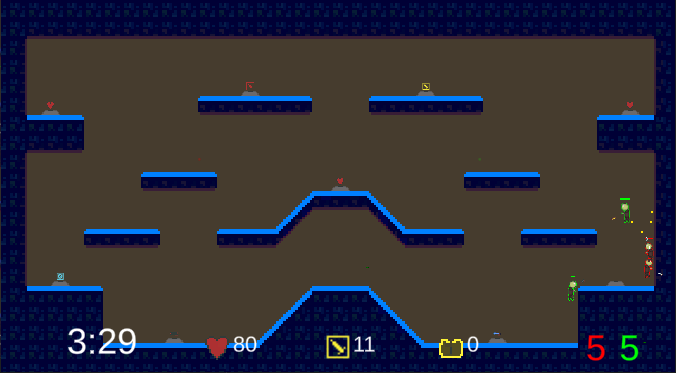
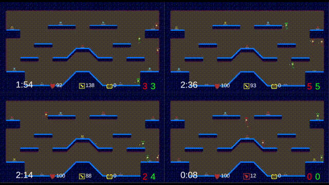
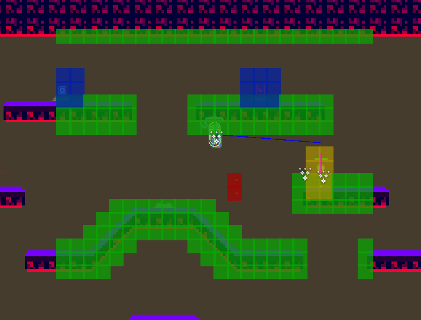

# PlatformerShooterAI
Platformer shooter environment for training RL agents

Observation: GridSensor2D (x,y,tags) and Vectorized in-game data

Action space: move-x-y, jump, aim, switch weapon

Custom GridSensor2D was developed, can track and draw gizmos for different tags

